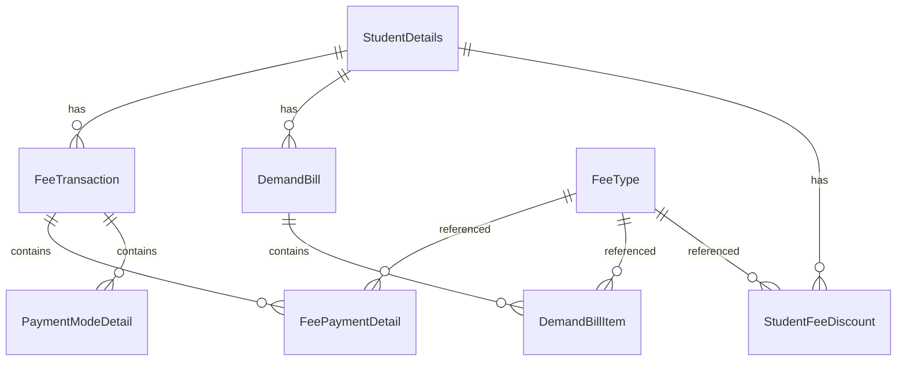

# Comprehensive Data Migration Feature for School Management System

Enable schools migrating from legacy systems to import complete student records and fee history via standardized Excel templates.

---

## User Review Required

> [!IMPORTANT]
> **Excel Template Structure Decision**: The plan proposes a multi-sheet Excel workbook approach for complete data. Please confirm if you prefer:
> 1. **Single workbook with multiple sheets** (Students, Fee Receipts, Demand Bills, Discounts) - easier for schools to manage
> 2. **Separate Excel files** per data type - simpler technical implementation

> [!WARNING]
> **Fee Type Mapping**: Legacy systems will have different fee type names. The import will require either:
> - Pre-creating matching fee types in your system, OR
> - Including a fee type mapping sheet in the template
> **Please confirm which approach you prefer.**

> [!CAUTION]
> **Data Integrity**: Importing fee receipts requires existing students. The import order must be:
> 1. Academic Sessions → 2. Fee Types → 3. Students → 4. Fee Records
> Schools must understand this dependency chain.

---

## Database Schema Analysis

### Student Data (35+ fields)

| Category | Fields |
|----------|--------|
| **Core Info** | studentId, name, dob, gender, status, className, section, rollNumber, admissionDate, sessionId |
| **Contact** | phone, whatsAppNo, email, address |
| **Parents** | fatherName, fatherOccupation, fatherAadharNo, fatherPanNo, motherName, motherOccupation, motherAadharNo, motherPanNo |
| **Guardian** | guardianRelation, guardianName, guardianOccupation, guardianPhone, guardianEmail, guardianAadharNo, guardianPanNo, guardianAddress |
| **Government IDs** | aadharCardNo, apaarId |
| **Academic** | subjects, category, religion |
| **Transport** | routeCode/routeName, pickupStop, dropStop, transportType |

### Fee Data Structures



---

## Proposed Changes

### Backend - New Data Migration Module

---

#### [NEW] [data-migration.module.ts](file:///Users/sumitadm21/Downloads/GitHub-Sumit21adm/School-Management-System/backend/src/data-migration/data-migration.module.ts)

NestJS module registering the data migration service and controller.

---

#### [NEW] [data-migration.controller.ts](file:///Users/sumitadm21/Downloads/GitHub-Sumit21adm/School-Management-System/backend/src/data-migration/data-migration.controller.ts)

API endpoints for data migration:

| Endpoint | Method | Description |
|----------|--------|-------------|
| `/api/data-migration/templates/complete` | GET | Download complete Excel template (multi-sheet) |
| `/api/data-migration/templates/students` | GET | Download student-only template |
| `/api/data-migration/templates/fee-receipts` | GET | Download fee receipts template |
| `/api/data-migration/validate` | POST | Dry-run validation without import |
| `/api/data-migration/import/students` | POST | Import comprehensive student data |
| `/api/data-migration/import/fee-receipts` | POST | Import fee transaction records |
| `/api/data-migration/import/demand-bills` | POST | Import demand bill history |
| `/api/data-migration/import/discounts` | POST | Import student-specific discounts |

---

#### [NEW] [data-migration.service.ts](file:///Users/sumitadm21/Downloads/GitHub-Sumit21adm/School-Management-System/backend/src/data-migration/data-migration.service.ts)

Core migration logic including:

**Template Generation:**
- `generateCompleteTemplate()` - Multi-sheet workbook with:
  - **Instructions** sheet with field descriptions
  - **Reference Data** sheet listing valid classes, sections, fee types, routes
  - **Students** sheet with all 35+ columns
  - **Fee_Receipts** sheet for transaction imports
  - **Demand_Bills** sheet for bill history
  - **Discounts** sheet for student discounts

**Validation Logic:**
- Required field checks
- Data type validation (dates, numbers)
- Enum validation (gender, status, payment modes)
- Foreign key validation (class exists, fee type exists, route exists)
- Duplicate detection (studentId, receiptNo, billNo)

**Import Logic:**
- Transaction-wrapped imports for rollback on failure
- Row-by-row processing with error collection
- Skip-and-continue mode for partial imports
- Progress callbacks for large imports

---

#### [NEW] [dto/data-migration.dto.ts](file:///Users/sumitadm21/Downloads/GitHub-Sumit21adm/School-Management-System/backend/src/data-migration/dto/data-migration.dto.ts)

DTOs for import requests:
- `ImportStudentsDto` - comprehensive student fields
- `ImportFeeReceiptDto` - fee transaction import
- `ImportDemandBillDto` - demand bill import
- `ImportDiscountDto` - discount import
- `ValidationResultDto` - validation response structure

---

### Backend - Module Registration

#### [MODIFY] [app.module.ts](file:///Users/sumitadm21/Downloads/GitHub-Sumit21adm/School-Management-System/backend/src/app.module.ts)

Register the new `DataMigrationModule` in the imports array.

---

### Frontend - Data Migration UI

---

#### [NEW] [DataMigration.tsx](file:///Users/sumitadm21/Downloads/GitHub-Sumit21adm/School-Management-System/frontend/src/pages/settings/DataMigration.tsx)

Main data migration page with:
- Template download section with clear descriptions
- Multi-step import wizard:
  1. Select data type (Students / Fee Records / Complete)
  2. Upload Excel file
  3. Validation preview with error highlighting
  4. Confirmation and import execution
  5. Results summary with success/error counts

---

#### [NEW] [data-migration.ts](file:///Users/sumitadm21/Downloads/GitHub-Sumit21adm/School-Management-System/frontend/src/lib/api/data-migration.ts)

API client functions:
- `downloadTemplate(type: 'complete' | 'students' | 'fee-receipts')`
- `validateImport(file: File, type: string)`
- `importStudents(file: File, options: ImportOptions)`
- `importFeeReceipts(file: File, options: ImportOptions)`
- `importDemandBills(file: File, options: ImportOptions)`
- `importDiscounts(file: File, options: ImportOptions)`

---

#### [MODIFY] [App.tsx](file:///Users/sumitadm21/Downloads/GitHub-Sumit21adm/School-Management-System/frontend/src/App.tsx)

Add route for data migration page: `/settings/data-migration`

---

### Documentation

#### [NEW] [DATA_MIGRATION_GUIDE.md](file:///Users/sumitadm21/Downloads/GitHub-Sumit21adm/School-Management-System/docs/guides/DATA_MIGRATION_GUIDE.md)

Comprehensive guide including:
1. Overview and prerequisites
2. Template structure explanation
3. Field-by-field documentation with examples
4. Step-by-step import process
5. Common errors and solutions
6. FAQ section

---

## Excel Template Specifications

### Students Sheet Columns

| Column | Header | Required | Type | Validation | Example |
|--------|--------|----------|------|------------|---------|
| A | Student ID | ✅ | String | Unique, alphanumeric | STU2024001 |
| B | Name | ✅ | String | Min 2 chars | Rahul Kumar |
| C | Father Name | ✅ | String | Min 2 chars | Rajesh Kumar |
| D | Mother Name | ✅ | String | Min 2 chars | Priya Kumar |
| E | DOB | ✅ | Date | YYYY-MM-DD | 2015-03-15 |
| F | Gender | ✅ | Enum | male/female/other | male |
| G | Class | ✅ | String | Valid class name | 5 |
| H | Section | ✅ | String | A-Z | A |
| I | Roll Number | | String | | 15 |
| J | Admission Date | ✅ | Date | YYYY-MM-DD | 2024-04-01 |
| K | Address | ✅ | String | Min 5 chars | 123 Main St, City |
| L | Phone | ✅ | String | 10-15 digits | 9876543210 |
| M | WhatsApp No | | String | 10-15 digits | 9876543210 |
| N | Email | | String | Valid email | parent@email.com |
| O | Status | | String | active/inactive/passed/alumni | active |
| P | Category | | String | General/OBC/SC/ST/Others | General |
| Q | Religion | | String | Hindu/Muslim/Christian/etc | Hindu |
| R | Student Aadhar | | String | 12 digits | 123456789012 |
| S | APAAR ID | | String | | 123456789012 |
| T | Father Occupation | | String | Dropdown values | Businessman |
| U | Father Aadhar | | String | 12 digits | |
| V | Father PAN | | String | AAAAA0000A format | |
| W | Mother Occupation | | String | Dropdown values | |
| X | Mother Aadhar | | String | 12 digits | |
| Y | Mother PAN | | String | AAAAA0000A format | |
| Z | Guardian Relation | | String | Father/Mother/Other | Father |
| AA | Guardian Name | | String | | |
| AB | Guardian Phone | | String | 10-15 digits | |
| AC | Guardian Email | | String | Valid email | |
| AD | Route Code | | String | Valid route code | R1 |
| AE | Pickup Stop | | String | Valid stop name | Main Market |
| AF | Drop Stop | | String | Valid stop name | Main Market |
| AG | Transport Type | | String | pickup/drop/both | both |
| AH | Previous Dues | | Number | >= 0 | 5000 |
| AI | Advance Balance | | Number | >= 0 | 0 |

### Fee Receipts Sheet Columns

| Column | Header | Required | Type | Validation | Example |
|--------|--------|----------|------|------------|---------|
| A | Student ID | ✅ | String | Must exist | STU2024001 |
| B | Receipt No | ✅ | String | Unique | REC/2024/001 |
| C | Receipt Date | ✅ | Date | YYYY-MM-DD | 2024-05-15 |
| D | Fee Type | ✅ | String | Valid fee type | Tuition Fee |
| E | Amount | ✅ | Number | > 0 | 2500 |
| F | Discount | | Number | >= 0 | 500 |
| G | Net Amount | ✅ | Number | > 0 | 2000 |
| H | Payment Mode | ✅ | String | cash/upi/card/cheque/online | cash |
| I | Payment Ref | | String | For non-cash | TXN1234567 |
| J | Collected By | | String | | Office |
| K | Remarks | | String | | Monthly fee |
| L | Bill No | | String | Link to demand bill | BILL/2024/001 |

### Demand Bills Sheet Columns

| Column | Header | Required | Type | Validation | Example |
|--------|--------|----------|------|------------|---------|
| A | Student ID | ✅ | String | Must exist | STU2024001 |
| B | Bill No | ✅ | String | Unique | BILL/2024/001 |
| C | Bill Date | ✅ | Date | YYYY-MM-DD | 2024-04-01 |
| D | Due Date | ✅ | Date | YYYY-MM-DD | 2024-04-15 |
| E | Month | ✅ | Number | 1-12 | 4 |
| F | Year | ✅ | Number | 2020-2030 | 2024 |
| G | Fee Type | ✅ | String | Valid fee type | Tuition Fee |
| H | Amount | ✅ | Number | > 0 | 2500 |
| I | Discount | | Number | >= 0 | 0 |
| J | Previous Dues | | Number | >= 0 | 0 |
| K | Late Fee | | Number | >= 0 | 0 |
| L | Net Amount | ✅ | Number | > 0 | 2500 |
| M | Paid Amount | | Number | >= 0 | 2500 |
| N | Status | ✅ | String | PENDING/PAID/PARTIALLY_PAID | PAID |

---

## Error Handling Strategy

1. **Validation Phase** (Pre-import)
   - Parse all rows and collect errors
   - Return detailed error report with row numbers
   - Allow user to fix and re-upload

2. **Import Phase Errors**
   ```json
   {
     "success": false,
     "totalRows": 150,
     "processed": 145,
     "failed": 5,
     "errors": [
       { "row": 23, "field": "className", "message": "Class 'XI' not found. Valid values: 1, 2, ..., 12" },
       { "row": 67, "field": "studentId", "message": "Duplicate: Student 'STU001' already exists" }
     ]
   }
   ```

3. **Partial Import Mode**
   - Option to skip failed rows and continue
   - Summary of skipped vs imported records

---

## Verification Plan

### Automated Tests

1. **Unit Tests - Validation Logic** (`data-migration.service.spec.ts`)
   ```bash
   # Run from /backend directory
   npm run test -- --testPathPattern=data-migration.service.spec
   ```
   Tests to implement:
   - Required field validation
   - Date format validation
   - Enum validation (gender, status, payment modes)
   - Foreign key validation mocking
   - Duplicate detection

2. **Integration Tests - Import Flow** (`data-migration.controller.spec.ts`)
   ```bash
   # Run from /backend directory  
   npm run test -- --testPathPattern=data-migration.controller.spec
   ```
   Tests to implement:
   - Template generation returns valid Excel
   - Student import creates records correctly
   - Fee receipt import links to students
   - Transaction rollback on failure

### Manual Verification

> [!NOTE]
> The following manual tests require running the application locally.

**Test 1: Template Download**
1. Start application: `npm run dev` (from root)
2. Navigate to Settings → Data Migration
3. Click "Download Complete Template"
4. Verify Excel opens with 4+ sheets
5. Verify dropdowns work in Excel (classes, sections, fee types)

**Test 2: Student Import - Happy Path**
1. Fill template with 5 test students
2. Navigate to Data Migration → Import Students
3. Upload file and click "Validate"
4. Verify preview shows all 5 students correctly
5. Click "Import" and verify success message
6. Navigate to Admissions and verify students appear

**Test 3: Student Import - Error Handling**
1. Create template with intentional errors:
   - Row 2: Missing required field (name)
   - Row 3: Invalid class name
   - Row 4: Duplicate student ID
   - Row 5: Invalid date format
2. Upload and validate
3. Verify all 4 errors are displayed with row numbers
4. Verify no data is imported (transaction rolled back)

**Test 4: Fee Receipt Import**
1. First import student: STU-TEST-001
2. Create fee receipt entry for this student
3. Import fee receipts
4. Navigate to student's Fee Statement
5. Verify receipt appears with correct amounts

**Test 5: Opening Balance Migration**
1. Import student with Previous Dues = 5000
2. Navigate to student's Fee Dashboard
3. Verify outstanding dues shows ₹5000

---

## Performance Considerations

- **Batch Processing**: Process imports in batches of 100 rows
- **Progress Tracking**: Emit progress events for large imports
- **Memory Management**: Stream Excel reading for files > 5MB
- **Database Transactions**: Use transactions but commit in batches

---

## Timeline Estimate

| Phase | Estimated Time |
|-------|----------------|
| Template Design | 4-6 hours |
| Backend Implementation | 8-12 hours |
| Frontend Implementation | 6-8 hours |
| Testing & Documentation | 4-6 hours |
| **Total** | **22-32 hours** |

---

## Dependencies & Prerequisites

Before import, ensure these exist in the system:
1. **Academic Session** - Active session for linking students
2. **School Classes** - All classes referenced in import
3. **Sections** - All sections referenced in import
4. **Fee Types** - All fee types referenced in fee records
5. **Routes & Stops** - If importing transport assignments
