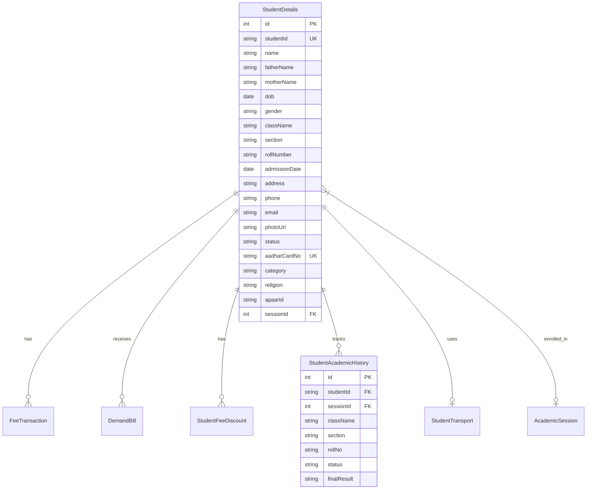
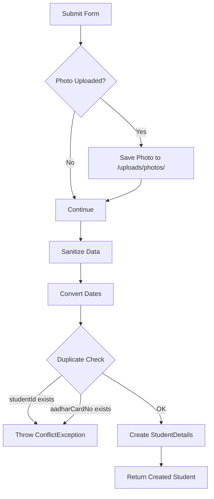
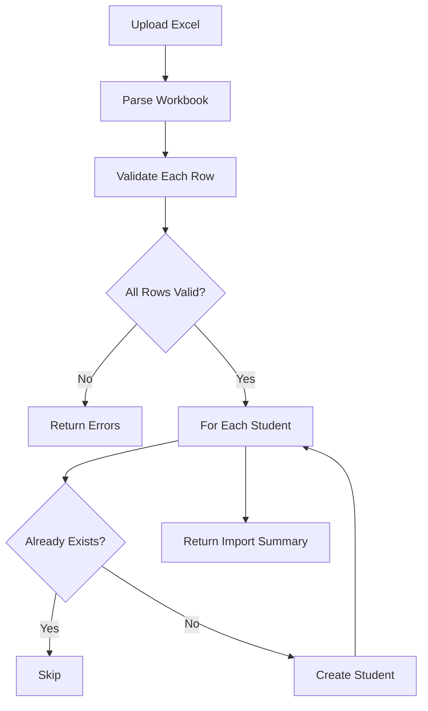
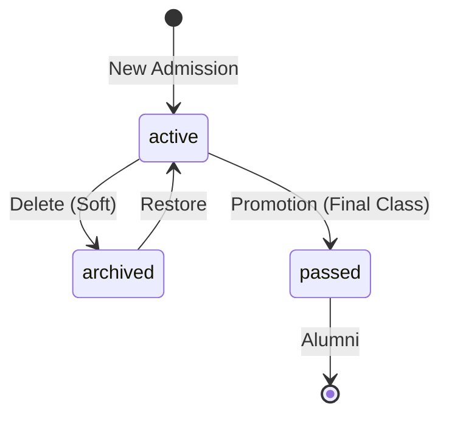

# Admissions Management - Developer Reference

## Overview
Student admission and management module handling registration, profile management, bulk import/export, and dashboard statistics with birthday tracking.

---

## Database Design

### Entity Relationship Diagram



### Key Fields - StudentDetails

| Field | Type | Description |
|-------|------|-------------|
| `studentId` | string | Unique student ID (e.g., "STU2025001") |
| `status` | string | `active`, `archived`, `passed` (alumni) |
| `sessionId` | int | Current academic session |
| `category` | string | General, OBC, SC/ST, Others, NA |
| `apaarId` | string | APAAR ID (Aadhaar-based education ID) |  

### Parent/Guardian Document Fields

| Field | Description |
|-------|-------------|
| `fatherAadharNo`, `fatherPanNo` | Father's documents |
| `motherAadharNo`, `motherPanNo` | Mother's documents |
| `guardianRelation`, `guardianName`, `guardianPhone` | Guardian info |
| `guardianAadharNo`, `guardianPanNo`, `guardianAddress` | Guardian documents |

---

## API Endpoints

| Method | Endpoint | Description |
|--------|----------|-------------|
| POST | `/admissions` | Create new student (with photo upload) |
| GET | `/admissions` | List students with filters & pagination |
| GET | `/admissions/:id` | Get student details with relations |
| PUT | `/admissions/:id` | Update student (with photo upload) |
| DELETE | `/admissions/:id` | Archive student (soft delete) |
| PATCH | `/admissions/:id/restore` | Restore archived student |
| GET | `/admissions/sections/:className` | Get sections for a class |
| GET | `/admissions/dashboard-stats` | Dashboard statistics |
| GET | `/admissions/template` | Download Excel import template |
| POST | `/admissions/import` | Bulk import from Excel |
| GET | `/admissions/export` | Export to Excel/PDF |

### Query Parameters (List)

| Parameter | Description |
|-----------|-------------|
| `search` | Search by name or studentId |
| `className` | Filter by class |
| `section` | Filter by section |
| `status` | Filter by status |
| `sessionId` | Filter by session |
| `page`, `limit` | Pagination |
| `sortBy`, `order` | Sorting (asc/desc) |

---

## Business Logic & Workflows

### 1. New Admission Flow



### 2. Bulk Import Process



### 3. Student Status Lifecycle



---

## Key Implementation Notes

1. **Photo Upload**: Stored in `./uploads/photos/` with random filename
2. **Soft Delete**: Sets status to `archived`, not actual deletion
3. **Duplicate Detection**: Catches Prisma P2002 error for unique constraints
4. **Optional Fields**: Empty strings converted to `null` for unique fields
5. **Transport Fields**: Stripped from admission DTO (handled separately)

### Dashboard Statistics

```typescript
// Returns:
{
  stats: {
    active: number,    // Active students
    alumni: number,    // Passed out students  
    archived: number,  // Archived students
    birthdayCount: number
  },
  birthdays: [...]     // Students with birthday today
}
```

---

## Related Files

| File | Purpose |
|------|---------|
| [admissions.service.ts](file:///Users/sumitadm21/Downloads/GitHub-Sumit21adm/School-Management-System/backend/src/admissions/admissions.service.ts) | Main service (380 lines) |
| [admissions.controller.ts](file:///Users/sumitadm21/Downloads/GitHub-Sumit21adm/School-Management-System/backend/src/admissions/admissions.controller.ts) | API endpoints |

---

*Last Updated: January 17, 2026*
