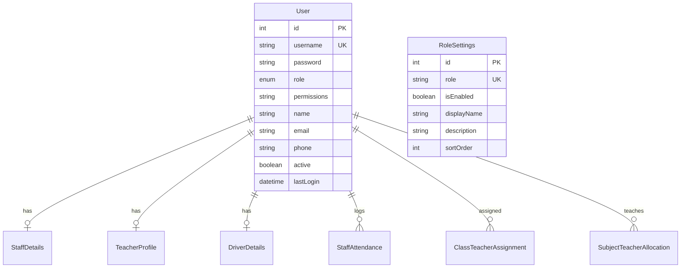
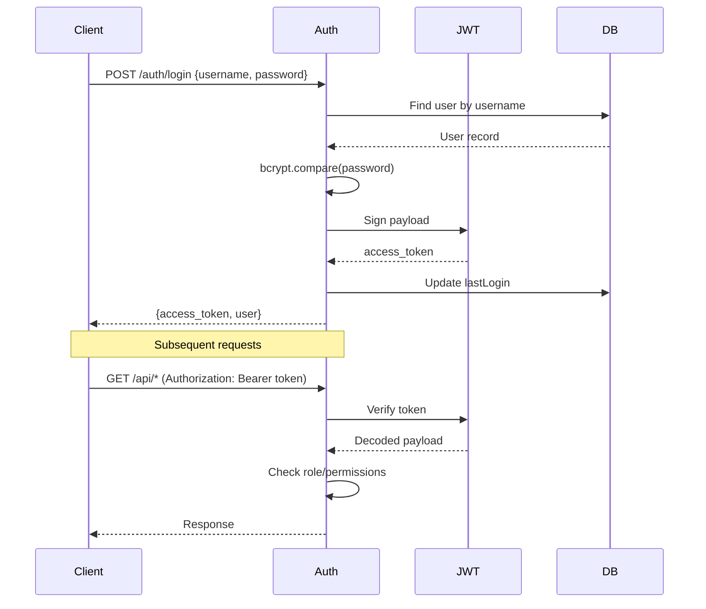

# Authentication & Users - Developer Reference

## Overview
JWT-based authentication system with role-based access control (RBAC) and configurable permissions.

---

## Database Design



### User Roles (Enum)

```typescript
enum UserRole {
  SUPER_ADMIN,      // System administrator (highest)
  PRINCIPAL,        // School head
  VICE_PRINCIPAL,   // Deputy head
  ADMIN,            // School administrator
  HEAD_OF_DEPARTMENT,
  COORDINATOR,      // Academic coordinator
  SECTION_INCHARGE,
  TEACHER,
  ACCOUNTANT,
  RECEPTIONIST,
  LIBRARIAN,
  LAB_ASSISTANT,
  OFFICE_STAFF,
  CLERK,
  DRIVER,
  CONDUCTOR,
  SECURITY,
  PEON,
  PARENT,
  STUDENT
}
```

---

## API Endpoints

| Method | Endpoint | Description |
|--------|----------|-------------|
| POST | `/auth/login` | Login and get JWT token |
| GET | `/auth/validate` | Validate current token |
| GET | `/users` | List all users |
| POST | `/users` | Create user |
| PUT | `/users/:id` | Update user |
| DELETE | `/users/:id` | Delete user |
| GET | `/role-settings` | Get configurable roles |

---

## Authentication Flow



### JWT Payload
```typescript
{
  sub: userId,
  username: string,
  role: UserRole
}
```

### Permission Storage
Permissions stored as JSON string array:
```typescript
permissions: '["fees_view","fees_collect","admissions_view"]'
```

---

## Guards & Decorators

### Usage in Controllers
```typescript
@Controller('fees')
@UseGuards(JwtAuthGuard, RolesGuard)
export class FeesController {
  
  @Post('collect')
  @Roles('ACCOUNTANT', 'ADMIN', 'SUPER_ADMIN')
  collectFee() { ... }
}
```

---

## Related Files

| File | Purpose |
|------|---------|
| [auth.service.ts](file:///Users/sumitadm21/Downloads/GitHub-Sumit21adm/School-Management-System/backend/src/auth/auth.service.ts) | Login/validate (77 lines) |
| [jwt-auth.guard.ts](file:///Users/sumitadm21/Downloads/GitHub-Sumit21adm/School-Management-System/backend/src/auth/jwt-auth.guard.ts) | JWT guard |
| [roles.guard.ts](file:///Users/sumitadm21/Downloads/GitHub-Sumit21adm/School-Management-System/backend/src/auth/roles.guard.ts) | Role guard |
| [roles.decorator.ts](file:///Users/sumitadm21/Downloads/GitHub-Sumit21adm/School-Management-System/backend/src/auth/roles.decorator.ts) | @Roles decorator |

---

*Last Updated: January 17, 2026*
