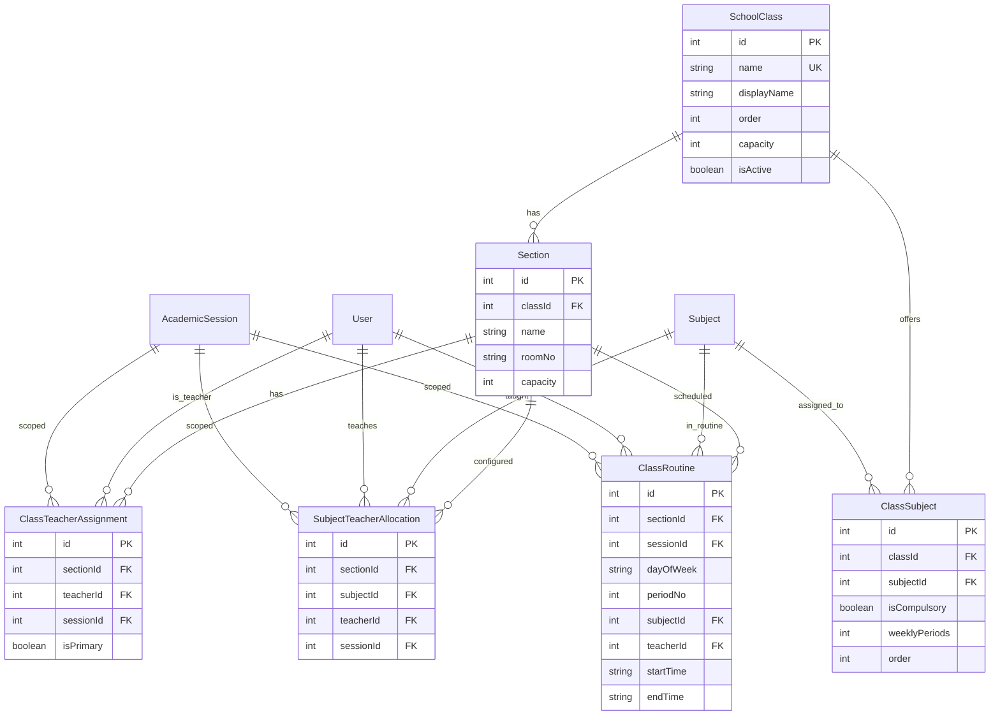

# Classes & Subjects - Developer Reference

## Overview
School class management, sections, subject allocation, teacher assignments, and class routines.

---

## Database Design



### Class Order
Classes ordered for progression:
- Play (1) → Nursery (2) → LKG (3) → UKG (4) → 1 (5) → ... → 12 (15)

---

## API Endpoints

### Classes & Sections

| Method | Endpoint | Description |
|--------|----------|-------------|
| GET | `/classes` | List all classes |
| POST | `/classes` | Create class |
| PATCH | `/classes/:id` | Update class |
| DELETE | `/classes/:id` | Delete class |
| GET | `/sections` | List sections |
| POST | `/sections` | Create section |

### Teacher Assignments

| Method | Endpoint | Description |
|--------|----------|-------------|
| GET | `/class-teacher-assignments` | List assignments |
| POST | `/class-teacher-assignments` | Create assignment |
| DELETE | `/class-teacher-assignments/:id` | Remove |

### Subject Allocations

| Method | Endpoint | Description |
|--------|----------|-------------|
| GET | `/subject-allocations` | List allocations |
| POST | `/subject-allocations` | Create allocation |
| DELETE | `/subject-allocations/:id` | Remove |

### Class Routines

| Method | Endpoint | Description |
|--------|----------|-------------|
| GET | `/routines/:sectionId/:sessionId` | Get routine |
| POST | `/routines` | Create/update slot |
| DELETE | `/routines/:id` | Delete slot |

---

## Key Concepts

### Class Teacher Types
- `isPrimary = true`: Class Teacher
- `isPrimary = false`: Co-Teacher/Backup

### Routine Slot
```typescript
{
  sectionId: 1,
  sessionId: 1,
  dayOfWeek: 'MONDAY',  // MONDAY - SATURDAY
  periodNo: 1,          // 1, 2, 3...
  subjectId: 5,         // null for Break
  teacherId: 10,
  startTime: '09:00',
  endTime: '09:45'
}
```

---

## Related Files

| File | Purpose |
|------|---------|
| [classes/](file:///Users/sumitadm21/Downloads/GitHub-Sumit21adm/School-Management-System/backend/src/modules/classes) | Class module |
| [sections/](file:///Users/sumitadm21/Downloads/GitHub-Sumit21adm/School-Management-System/backend/src/modules/sections) | Section module |
| [routines/](file:///Users/sumitadm21/Downloads/GitHub-Sumit21adm/School-Management-System/backend/src/modules/routines) | Routine module |
| [subjects/](file:///Users/sumitadm21/Downloads/GitHub-Sumit21adm/School-Management-System/backend/src/subjects) | Subject module |

---

*Last Updated: January 17, 2026*
