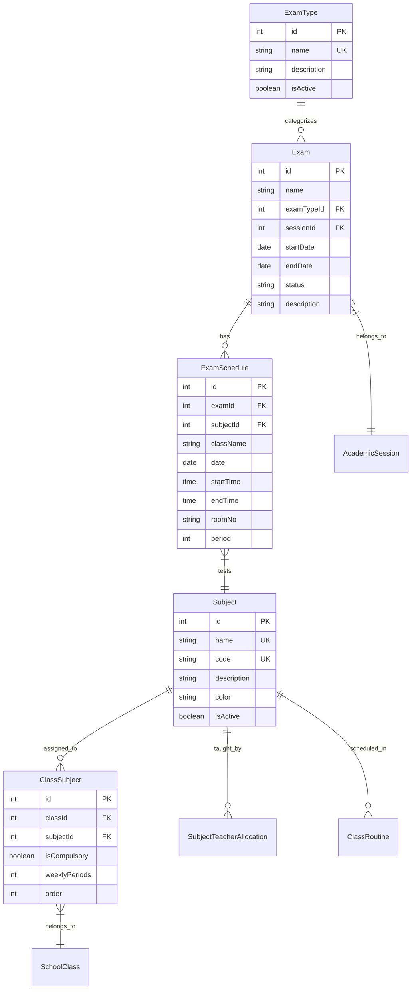
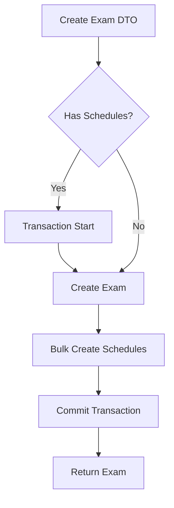

# Examination Module - Developer Reference

## Overview
Examination management including exam types, exams, schedules, and subject management.

---

## Database Design

### Exam Status
- `UPCOMING` - Scheduled for future
- `ONGOING` - Currently in progress
- `COMPLETED` - Finished

---

## API Endpoints

### Exam Types

| Method | Endpoint | Description |
|--------|----------|-------------|
| GET | `/examination/types` | List exam types |
| POST | `/examination/types` | Create exam type |
| PATCH | `/examination/types/:id` | Update exam type |
| DELETE | `/examination/types/:id` | Delete exam type |

### Exams

| Method | Endpoint | Description |
|--------|----------|-------------|
| GET | `/examination/exams` | List exams |
| GET | `/examination/exams/:id` | Get exam with schedules |
| POST | `/examination/exams` | Create exam |
| PATCH | `/examination/exams/:id` | Update exam |
| DELETE | `/examination/exams/:id` | Delete exam |
| POST | `/examination/exams/:id/schedule` | Add schedule |
| DELETE | `/examination/schedules/:id` | Delete schedule |

### Subjects

| Method | Endpoint | Description |
|--------|----------|-------------|
| GET | `/subjects` | List subjects |
| POST | `/subjects` | Create subject |
| PATCH | `/subjects/:id` | Update subject |
| DELETE | `/subjects/:id` | Delete subject |

---

## Create Exam with Schedules

### Validation
- `startDate <= endDate`
- Schedule date within exam date range (optional warning)

---

## Related Files

| File | Purpose |
|------|---------|
| [exams.service.ts](file:///Users/sumitadm21/Downloads/GitHub-Sumit21adm/School-Management-System/backend/src/examination/services/exams.service.ts) | Exam CRUD (126 lines) |
| [exam-types.service.ts](file:///Users/sumitadm21/Downloads/GitHub-Sumit21adm/School-Management-System/backend/src/examination/services/exam-types.service.ts) | Types (47 lines) |
| [subjects.service.ts](file:///Users/sumitadm21/Downloads/GitHub-Sumit21adm/School-Management-System/backend/src/examination/services/subjects.service.ts) | Subjects (52 lines) |

---

*Last Updated: January 17, 2026*
