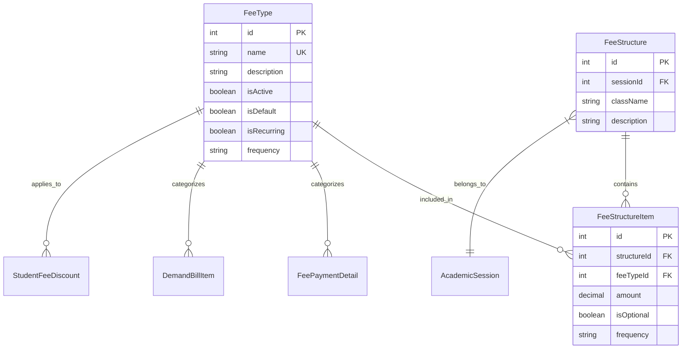

# Fee Types & Structure - Developer Reference

## Overview
Configuration module for fee types (categories) and class-wise fee structures per academic session.

---

## Database Design



### Fee Type Frequencies
- `Monthly` - Recurring monthly (Tuition Fee)
- `Yearly` - Once per year (Annual Fee)
- `One-time` - Once only (Admission Fee)
- `Refundable` - Returnable (Security Deposit)

---

## API Endpoints

### Fee Types

| Method | Endpoint | Description |
|--------|----------|-------------|
| GET | `/fee-types` | List all fee types |
| GET | `/fee-types/by-structure` | Get fee types in structure |
| GET | `/fee-types/:id` | Get fee type by ID |
| POST | `/fee-types` | Create fee type |
| PATCH | `/fee-types/:id` | Update fee type |
| DELETE | `/fee-types/:id` | Delete fee type |

### Fee Structure

| Method | Endpoint | Description |
|--------|----------|-------------|
| GET | `/fee-structure/:sessionId/:className` | Get structure |
| POST | `/fee-structure/:sessionId/:className` | Upsert structure |
| POST | `/fee-structure/copy` | Copy structure between sessions |

---

## Key Implementation

### Upsert Structure
Replaces entire structure on save (delete + create):

```typescript
// Delete existing
await prisma.feeStructure.deleteMany({ where: { sessionId, className } });

// Create new with items
await prisma.feeStructure.create({
  data: { sessionId, className, feeItems: { create: items } }
});
```

### Copy Structure with Increase
```typescript
// Copy from sourceSession to targetSession with % increase
const newAmount = oldAmount * (1 + percentageIncrease / 100);
```

---

## Related Files

| File | Purpose |
|------|---------|
| [fee-types.service.ts](file:///Users/sumitadm21/Downloads/GitHub-Sumit21adm/School-Management-System/backend/src/fee-types/fee-types.service.ts) | Fee types (130 lines) |
| [fee-structure.service.ts](file:///Users/sumitadm21/Downloads/GitHub-Sumit21adm/School-Management-System/backend/src/fee-structure/fee-structure.service.ts) | Structure (155 lines) |

---

*Last Updated: January 17, 2026*
