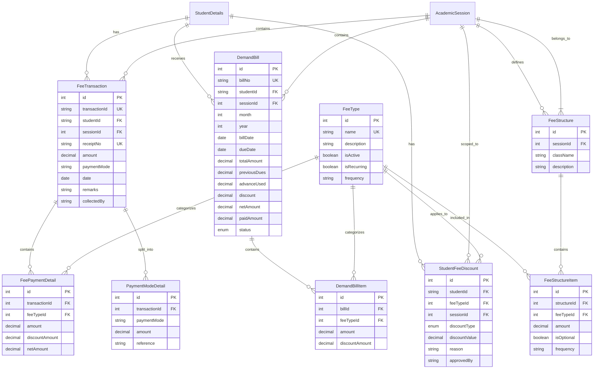
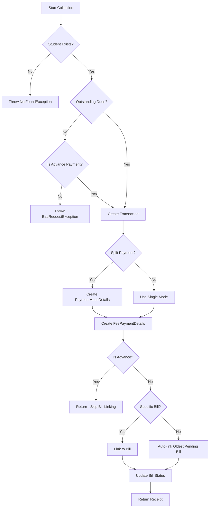
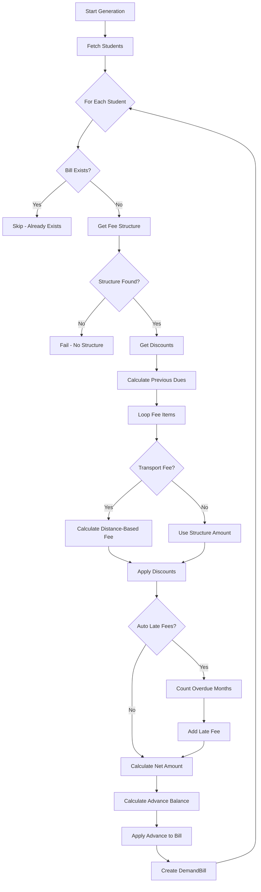

# Fees Management - Developer Reference

## Overview
Comprehensive fee management module handling fee collection, demand bill generation, split payments, reports, and PDF generation. Integrates with Transport module for distance-based transport fee calculation.

---

## Database Design

### Entity Relationship Diagram



### Key Tables

| Table | Purpose |
|-------|---------|
| `FeeTransaction` | Records each payment with receipt number |
| `FeePaymentDetail` | Breakdown of payment by fee type |
| `PaymentModeDetail` | Split payment support (cash + UPI, etc.) |
| `DemandBill` | Monthly fee bill per student |
| `DemandBillItem` | Line items in demand bill |
| `FeeType` | Master list of fee categories |
| `FeeStructure` | Class-wise fee configuration per session |
| `FeeStructureItem` | Individual fees in a structure |
| `StudentFeeDiscount` | Student-specific discounts |

### Enums

**BillStatus**: `PENDING` | `SENT` | `PARTIALLY_PAID` | `PAID` | `OVERDUE` | `CANCELLED`

**PaymentMode**: `cash` | `cheque` | `online` | `card` | `upi`

**DiscountType**: `PERCENTAGE` | `FIXED`

---

## API Endpoints

### Fee Collection

| Method | Endpoint | Description | Roles |
|--------|----------|-------------|-------|
| POST | `/fees/collect` | Collect fee with split payments | ACCOUNTANT, ADMIN |
| POST | `/fees/statement` | Get student fee statement | ACCOUNTANT, ADMIN, RECEPTIONIST |
| GET | `/fees/dashboard/:studentId/session/:sessionId` | Student fee dashboard | ACCOUNTANT, ADMIN, RECEPTIONIST |
| GET | `/fees/fee-book/:studentId/session/:sessionId` | Yearly fee book | ACCOUNTANT, ADMIN, RECEPTIONIST |
| GET | `/fees/transactions` | List transactions with filters | ACCOUNTANT, ADMIN |

### Demand Bills

| Method | Endpoint | Description | Roles |
|--------|----------|-------------|-------|
| POST | `/fees/demand-bills/generate` | Generate demand bills | ADMIN, ACCOUNTANT |
| GET | `/fees/demand-bills/history/:sessionId` | Bill generation history | ADMIN, ACCOUNTANT |
| DELETE | `/fees/demand-bills/batch` | Delete bill batch | ADMIN |

### Reports

| Method | Endpoint | Description | Roles |
|--------|----------|-------------|-------|
| GET | `/fees/reports/outstanding` | Outstanding dues by class | ACCOUNTANT, ADMIN |
| GET | `/fees/reports/history` | Bill generation history report | ACCOUNTANT, ADMIN |
| GET | `/fees/reports/fee-analysis` | Fee type analysis with collection rates | ACCOUNTANT, ADMIN |

### PDF Generation

| Method | Endpoint | Description | Roles |
|--------|----------|-------------|-------|
| GET | `/fees/receipt/pdf?receiptNo=` | Generate receipt PDF | ACCOUNTANT, ADMIN, RECEPTIONIST |
| GET | `/fees/demand-bill/pdf?billNo=` | Generate demand bill PDF | ACCOUNTANT, ADMIN, RECEPTIONIST |
| POST | `/fees/demand-bills/batch-pdf` | Batch generate demand bills PDF | ACCOUNTANT, ADMIN |

---

## Business Logic & Workflows

### 1. Fee Collection Flow



### 2. Demand Bill Generation



### 3. Split Payment Support

The system supports multiple payment modes per transaction:

```typescript
// Example: ₹1000 paid as ₹600 Cash + ₹400 UPI
{
  paymentModes: [
    { paymentMode: 'cash', amount: 600 },
    { paymentMode: 'upi', amount: 400, reference: 'UPI-REF-123' }
  ]
}
```

- Stored in `PaymentModeDetail` table
- Primary mode stored in main transaction for backward compatibility
- Total must match fee total (validated with 0.01 tolerance)

### 4. Transport Fee Integration

Transport fee is calculated dynamically based on stop distance:

1. Get student's pickup/drop stop distances
2. Use higher distance for billing
3. Lookup matching `TransportFareSlab`
4. If no slab found, fee = 0 (strict distance-based pricing)

> [!IMPORTANT]
> `Route.monthlyFee` is **deprecated**. Use `TransportFareSlab` for distance-based pricing.

### 5. Advance Payment Handling

- **Detection**: Fee types with "Advance" in name are treated as advance payments
- **Storage**: Recorded as normal transaction but skips bill linking
- **Application**: `advanceUsed` field in DemandBill tracks applied advance
- **Balance**: `calculateAdvanceBalance()` = Total Paid - Total Net Billed

---

## Key Implementation Notes

1. **Receipt Number**: Auto-generated as `REC{timestamp}` if not provided
2. **Transaction ID**: Auto-generated as `TXN{timestamp}`
3. **Bill Number**: Format `BILL{year}{month}{timestamp}`
4. **Due Date**: 10th of month following bill month (if not specified)
5. **Late Fee**: Per-month calculation based on overdue month count

---

## Related Files

| File | Purpose |
|------|---------|
| [fees.service.ts](file:///Users/sumitadm21/Downloads/GitHub-Sumit21adm/School-Management-System/backend/src/fees/fees.service.ts) | Main service (1536 lines) |
| [fees.controller.ts](file:///Users/sumitadm21/Downloads/GitHub-Sumit21adm/School-Management-System/backend/src/fees/fees.controller.ts) | API endpoints |
| [fee-collection.dto.ts](file:///Users/sumitadm21/Downloads/GitHub-Sumit21adm/School-Management-System/backend/src/fees/dto/fee-collection.dto.ts) | Collection DTOs |
| [demand-bill.dto.ts](file:///Users/sumitadm21/Downloads/GitHub-Sumit21adm/School-Management-System/backend/src/fees/dto/demand-bill.dto.ts) | Bill DTOs |
| [receipt-pdf.service.ts](file:///Users/sumitadm21/Downloads/GitHub-Sumit21adm/School-Management-System/backend/src/fees/receipt-pdf.service.ts) | Receipt PDF generation |
| [demand-bill-pdf.service.ts](file:///Users/sumitadm21/Downloads/GitHub-Sumit21adm/School-Management-System/backend/src/fees/demand-bill-pdf.service.ts) | Bill PDF generation |

---

*Last Updated: January 17, 2026*
