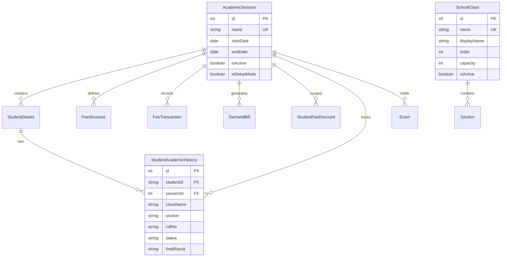
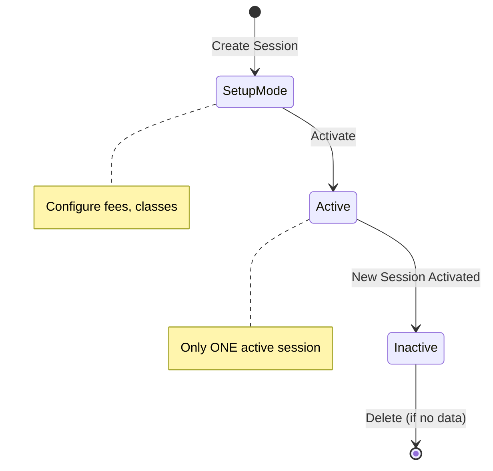
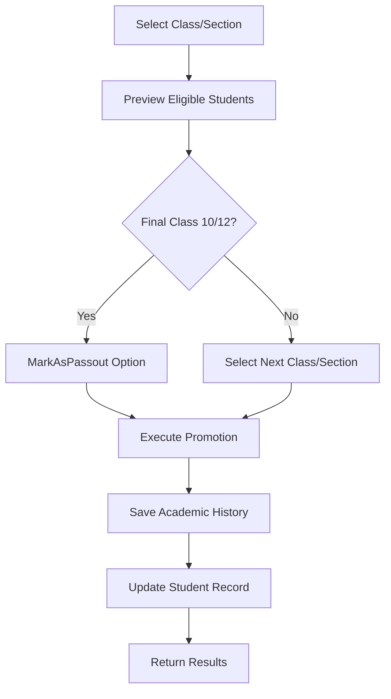

# Sessions & Promotions - Developer Reference

## Overview
Academic session lifecycle management and student promotion system. Sessions define academic years, and promotions move students to the next class at year-end.

---

## Database Design

### Entity Relationship Diagram



### Key Fields - AcademicSession

| Field | Type | Description |
|-------|------|-------------|
| `name` | string | e.g., "2025-2026" |
| `startDate`, `endDate` | date | Session duration |
| `isActive` | boolean | Only one session can be active |
| `isSetupMode` | boolean | True during initial setup |

---

## API Endpoints

### Sessions

| Method | Endpoint | Description |
|--------|----------|-------------|
| GET | `/sessions` | List all sessions |
| GET | `/sessions/active` | Get active session |
| GET | `/sessions/:id` | Get session by ID |
| POST | `/sessions` | Create new session |
| PATCH | `/sessions/:id` | Update session |
| POST | `/sessions/:id/activate` | Activate session |
| DELETE | `/sessions/:id` | Delete session |

### Promotions

| Method | Endpoint | Description |
|--------|----------|-------------|
| GET | `/promotions/preview` | Preview promotion candidates |
| POST | `/promotions/execute` | Execute student promotions |

---

## Business Logic & Workflows

### 1. Session Lifecycle



### 2. Promotion Workflow



### 3. Class Order Progression

Classes are ordered for automatic "next class" calculation:

```
Play → Nursery → LKG → UKG → 1 → 2 → ... → 10 → 11 → 12
```

Uses `SchoolClass.order` field for ordering.

---

## Key Implementation Notes

### Session Activation
```typescript
// Only one session can be active at a time
await prisma.academicSession.updateMany({
  where: { isActive: true },
  data: { isActive: false }
});

await prisma.academicSession.update({
  where: { id },
  data: { isActive: true, isSetupMode: false }
});
```

### Promotion Execution
1. **Fetch current details** from `StudentDetails`
2. **Save to history** in `StudentAcademicHistory`
3. **Update student** with new class, section, sessionId
4. **Mark as passed** if final class (status = 'passed')

### Calculate Next Class
```typescript
// Uses SchoolClass.order to find next class
const nextClass = await prisma.schoolClass.findFirst({
  where: { order: { gt: currentClass.order } },
  orderBy: { order: 'asc' }
});
```

---

## Related Files

| File | Purpose |
|------|---------|
| [sessions.service.ts](file:///Users/sumitadm21/Downloads/GitHub-Sumit21adm/School-Management-System/backend/src/sessions/sessions.service.ts) | Session CRUD (146 lines) |
| [promotions.service.ts](file:///Users/sumitadm21/Downloads/GitHub-Sumit21adm/School-Management-System/backend/src/promotions/promotions.service.ts) | Promotion logic (128 lines) |

---

*Last Updated: January 17, 2026*
