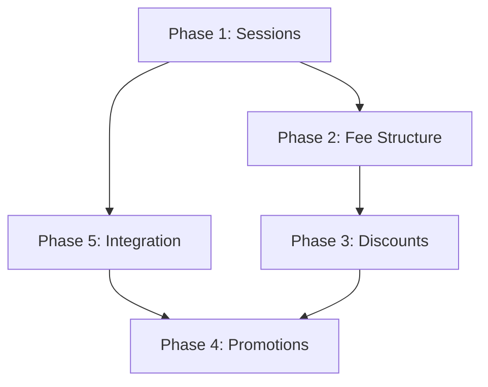

# Implementation Phases - Session Management

**Version:** 1.0  
**Date:** 2025-12-04  
**Status:** 📝 Draft

---

## Overview

Detailed phase-by-phase implementation plan with task breakdown, dependencies, and timelines.

**Total Estimated Time:** 10-15 coding sessions  
**Team Size Assumption:** 1 developer  
**Priority Order:** Phase 1 → 2 → 5 → 4 → 3

---

## Phase 1: Session Management Foundation

**Goal:** Core session CRUD and settings page  
**Duration:** 2-3 sessions  
**Priority:** Critical (blocking for all other phases)

### Tasks

#### Backend (1 session)

1. **Create Database Migration**
   - [ ] Create `academic_sessions` table
   - [ ] Add indexes
   - [ ] Seed default session "APR 2024-MAR 2025"
   - [ ] Test migration

2. **Create Sessions Module**
   - [ ] Generate module: `nest g module sessions`
   - [ ] Generate controller: `nest g controller sessions`
   - [ ] Generate service: `nest g service sessions`
   - [ ] Add to app.module.ts

3. **Implement Session Service**
   - [ ] `findAll()` - List all sessions
   - [ ] `findActive()` - Get active session
   - [ ] `create()` - Create new session
   - [ ] `update()` - Update session
   - [ ] `activate()` - Activate session (deactivate others)
   - [ ] `delete()` - Delete session (with validation)
   - [ ] Add unit tests

4. **Implement Session Controller**
   - [ ] GET `/sessions`
   - [ ] GET `/sessions/active`
   - [ ] POST `/sessions`
   - [ ] PUT `/sessions/:id`
   - [ ] POST `/sessions/:id/activate`
   - [ ] DELETE `/sessions/:id`
   - [ ] Add DTOs and validation

#### Frontend (1-2 sessions)

5. **Create Session Context**
   - [ ] Create `SessionContext.tsx`
   - [ ] Provider with active session state
   - [ ] `switchSession()` function
   - [ ] Wrap App with provider

6. **Session API Service**
   - [ ] Add `sessionService` to `api.ts`
   - [ ] Implement all endpoints
   - [ ] Add TypeScript types

7. **Global Session Selector**
   - [ ] Create `SessionSelector` component
   - [ ] Add to app header
   - [ ] Dropdown with all sessions
   - [ ] Persist selection in localStorage
   - [ ] Style with MUI

8. **Settings - Sessions Page**
   - [ ] Create `/settings/sessions` route
   - [ ] Session list table component
   - [ ] New/Edit session dialog
   - [ ] Activate/Delete actions
   - [ ] Add to navigation menu
   - [ ] TanStack Query integration

#### Testing

9. **Integration Tests**
   - [ ] Backend API tests
   - [ ] Session activation flow
   - [ ] Data validation tests

**Dependencies:** None  
**Deliverable:** Working session management with UI

---

## Phase 2: Fee Structure Management

**Goal:** Class-wise fee structures per session  
**Duration:** 3-4 sessions  
**Priority:** High (needed before production)

### Tasks

#### Backend (2 sessions)

1. **Create Database Migrations**
   - [ ] Create `fee_types` table
   - [ ] Create `fee_structures` table
   - [ ] Create `fee_structure_items` table
   - [ ] Seed default fee types (7 types)
   - [ ] Add indexes
   - [ ] Test migrations

2. **Create Fee Types Module**
   - [ ] Generate module, controller, service
   - [ ] Service methods: findAll, create, update, delete
   - [ ] Controller endpoints
   - [ ] Validation (cannot delete if used)

3. **Create Fee Structure Module**
   - [ ] Generate module, controller, service
   - [ ] `findBySessionAndClass()` - Get structure
   - [ ] `upsert()` - Create/update structure
   - [ ] `copy()` - Copy from another session
   - [ ] Calculation logic with percentage increase
   - [ ] Transaction-wrapped saves

4. **Add Unit Tests**
   - [ ] Fee type CRUD tests
   - [ ] Fee structure tests
   - [ ] Copy functionality test

#### Frontend (1-2 sessions)

5. **Settings - Fee Types Page**
   - [ ] Create `/settings/fee-types` route
   - [ ] List fee types
   - [ ] Create/Edit dialog
   - [ ] Delete with validation

6. **Settings - Fee Structure Page**
   - [ ] Create `/settings/fee-structure` route
   - [ ] Session + Class selectors
   - [ ] Editable fee items table
   - [ ] Add custom fee type
   - [ ] Real-time total calculation
   - [ ] Save all button

7. **Copy Fee Structure Feature**
   - [ ] Copy dialog component
   - [ ] Source session selector
   - [ ] Class selection (all/specific)
   - [ ] Percentage increase input
   - [ ] Execute copy with progress

**Dependencies:** Phase 1 (sessions must exist)  
**Deliverable:** Complete fee structure management

---

## Phase 3: Student Discounts

**Goal:** Individual student fee discounts  
**Duration:** 1-2 sessions  
**Priority:** Medium (nice to have)

### Tasks

#### Backend (0.5 session)

1. **Create Database Migration**
   - [ ] Create `student_fee_discounts` table
   - [ ] Add indexes
   - [ ] Add foreign keys

2. **Create Discounts Module**
   - [ ] Generate module, controller, service
   - [ ] Service methods: findByStudent, create, update, delete
   - [ ] Validation: percentage ≤ 100, fixed ≤ fee amount
   - [ ] Controller endpoints

#### Frontend (0.5-1 session)

3. **Student Discounts Tab**
   - [ ] Add "Discounts" tab to student profile
   - [ ] List discounts table
   - [ ] Add discount dialog
   - [ ] Type selector (percentage/fixed)
   - [ ] Edit/delete actions

4. **Fee Collection Integration**
   - [ ] Auto-load fee structure with discounts
   - [ ] Show discount calculations
   - [ ] Display final amounts

**Dependencies:** Phase 2 (fee types must exist)  
**Deliverable:** Student discount management

---

## Phase 4: Student Promotion System

**Goal:** Bulk student promotion with review  
**Duration:** 2-3 sessions  
**Priority:** Medium (needed annually)

### Tasks

#### Backend (1 session)

1. **Create Promotions Module**
   - [ ] Generate module, controller, service
   - [ ] `preview()` - Get students for promotion
   - [ ] `execute()` - Perform bulk promotion
   - [ ] Next class mapping logic
   - [ ] Passout logic (Class 10 & 12)
   - [ ] Discount migration logic

2. **Promotion Service Logic**
   - [ ] Validate target session exists
   - [ ] Update student class & session
   - [ ] Mark passout: status="Passed", isActive=false
   - [ ] Copy discounts to new session
   - [ ] Transaction-wrapped for atomicity
   - [ ] Audit logging

#### Frontend (1-2 sessions)

3. **Promotion Page - Step 1**
   - [ ] Create `/promotions` route
   - [ ] Session, class, section selectors
   - [ ] Next class display
   - [ ] Validate availability (FEB-MAR-APR)

4. **Promotion Page - Step 2**
   - [ ] Student table with checkboxes
   - [ ] Select All / Deselect All
   - [ ] Bulk action buttons (Promote/Retain/Passout)
   - [ ] Passout only for Class 10 & 12
   - [ ] Search/filter students
   - [ ] Summary counter

5. **Promotion Page - Step 3**
   - [ ] Confirmation screen
   - [ ] Review summary
   - [ ] Warning messages
   - [ ] Execute promotion
   - [ ] Progress indicator
   - [ ] Success/failure report

**Dependencies:** Phase 1 (sessions), Phase 3 (discounts)  
**Deliverable:** Complete promotion workflow

---

## Phase 5: Session Context Integration

**Goal:** Integrate sessions into existing modules  
**Duration:** 2-3 sessions  
**Priority:** High (makes everything session-aware)

### Tasks

#### Backend (1 session)

1. **Modify Student Details Table**
   - [ ] Add `sessionId Int?` (nullable)
   - [ ] Set existing records to default session
   - [ ] Make `sessionId Int` (required)
   - [ ] Add foreign key constraint
   - [ ] Update Prisma schema

2. **Modify Fee Transactions Table**
   - [ ] Add `sessionId Int?` (nullable)
   - [ ] Map existing yearId to sessionId
   - [ ] Make `sessionId Int` (required)
   - [ ] Drop `yearId` column
   - [ ] Update Prisma schema

3. **Update Admissions Service**
   - [ ] Filter by sessionId in queries
   - [ ] Accept sessionId in create/update
   - [ ] Default to active session

4. **Update Fees Service**
   - [ ] Filter transactions by sessionId
   - [ ] Auto-use active session in collection
   - [ ] Load fee structure by session + class

5. **Update Dashboard Service**
   - [ ] Accept sessionId parameter
   - [ ] Filter all stats by session
   - [ ] Add session name to response

#### Frontend (1-2 sessions)

6. **Update Admission Form**
   - [ ] Add session selector field
   - [ ] Default to active session
   - [ ] Required validation

7. **Update Admissions List**
   - [ ] Filter by selected session
   - [ ] Show session in table
   - [ ] Update export/import

8. **Update Fee Collection**
   - [ ] Auto-load fee structure from active session
   - [ ] Apply discounts automatically
   - [ ] Show fee breakdown

9. **Update Dashboard**
   - [ ] Add session indicator
   - [ ] Filter all widgets by session
   - [ ] Update on session switch

10. **Update All Reports**
    - [ ] Add session filter
    - [ ] Show session in headers
    - [ ] Filter data by session

**Dependencies:** Phase 1 (sessions must exist)  
**Deliverable:** All modules are session-aware

---

## Implementation Order

### Recommended Sequence



### Rationale

1. **Phase 1 First:**  Everything depends on sessions
2. **Phase 2 or 5 Next:** Both can start after Phase 1
   - Phase 2 if focusing on fee setup
   - Phase 5 if prioritizing core module integration
3. **Phase 3:** Can be done anytime after Phase 2
4. **Phase 4 Last:** Depends on both sessions and discounts

---

## Timeline (Gantt Chart)

```
Week 1
  Mon-Wed: Phase 1 (Backend)  ████████
  Thu-Fri: Phase 1 (Frontend) █████

Week 2
  Mon-Wed: Phase 2 (Backend)  ████████
  Thu-Fri: Phase 2 (Frontend) █████

Week 3
  Mon-Tue: Phase 5 (Backend)  █████
  Wed-Fri: Phase 5 (Frontend) ███████

Week 4
  Mon:     Phase 3 (Backend)  ███
  Tue-Wed: Phase 3 (Frontend) ████
  Thu-Fri: Phase 4 (Backend)  █████

Week 5
  Mon-Wed: Phase 4 (Frontend) ████████
  Thu-Fri: Testing & Bug Fixes ████
```

**Total:** ~5 weeks (assuming 1 developer, 1 session = 1 day)

---

## Testing Strategy

### Per Phase Testing

**Phase 1:**
- [ ] Can create/edit/delete sessions
- [ ] Only one active session at a time
- [ ] Session selector works globally

**Phase 2:**
- [ ] Fee structures save correctly
- [ ] Copy functionality works
- [ ] Amounts calculate properly

**Phase 3:**
- [ ] Discounts apply correctly
- [ ] Percentage and fixed types work
- [ ] Validation prevents invalid discounts

**Phase 4:**
- [ ] Promotion updates class and session
- [ ] Passout marks students correctly
- [ ] Discounts carry forward

**Phase 5:**
- [ ] All modules filter by session
- [ ] Admission form saves session
- [ ] Fee collection uses correct structure
- [ ] Dashboard shows session-specific data

### Integration Testing

After all phases:
- [ ] End-to-end promotion workflow
- [ ] Fee collection with discounts
- [ ] Session switching updates all data
- [ ] Reports filter correctly

---

## Deployment Strategy

### Development Environment

1. Apply migrations incrementally
2. Test each phase before next
3. Seed sample data for testing

### Production Rollout

**Pre-deployment:**
1. Backup database
2. Test migration on staging
3. Create rollback plan

**Deployment Steps:**
1. Deploy Phase 1 (sessions only)
2. Configure initial session
3. Deploy Phase 2 (fee structures)
4. Configure fee structures for all classes
5. Deploy Phase 5 (integration)
6. Migrate existing data
7. Deploy Phase 3 & 4 (discounts, promotions)

**Post-deployment:**
1. Verify all data migrated
2. Test session switching
3. Train admin users
4. Monitor for issues

---

## Rollback Plan

### Phase-specific Rollback

**Phase 1:**
```sql
DROP TABLE academic_sessions;
-- No other changes to rollback
```

**Phase 2:**
```sql
DROP TABLE fee_structure_items;
DROP TABLE fee_structures;
DROP TABLE fee_types;
```

**Phase 3:**
```sql
DROP TABLE student_fee_discounts;
```

**Phase 4:**
```sql
-- No database changes, just remove routes
```

**Phase 5:**
```sql
ALTER TABLE student_details DROP COLUMN sessionId;
ALTER TABLE feetransaction_new ADD COLUMN yearId INT;
-- Restore yearId values from backup
```

### Complete Rollback

```bash
# Restore from pre-migration backup
mysql -u root -p school_management < backup_pre_session_migration.sql
```

---

## Risk Mitigation

### Risks & Mitigation

| Risk | Impact | Mitigation |
|------|--------|------------|
| Data loss during migration | High | Backup before migration, test on staging |
| Performance degradation | Medium | Add proper indexes, test with 5000+ records |
| User confusion | Medium | Provide training, clear UI labels |
| Session conflicts | Low | Validation ensures only one active |
| Discount calculation errors | Medium | Comprehensive unit tests, manual QA |

---

## Success Criteria

### Phase 1
- ✅ Can create and manage sessions
- ✅ Session selector works globally
- ✅ Active session management works

### Phase 2
- ✅ Fee structures configured for all classes
- ✅ Copy function works correctly
- ✅ Amounts save and load properly

### Phase 3
- ✅ Discounts can be added/edited/removed
- ✅ Discounts apply in fee collection
- ✅ Validation prevents errors

### Phase 4
- ✅ Students promote correctly
- ✅ Passout works for Class 10 & 12
- ✅ Discounts carry forward

### Phase 5
- ✅ All existing features work with sessions
- ✅ No data loss from migration
- ✅ Performance is acceptable

### Overall
- ✅ System handles 10+ sessions
- ✅ 5000+ students per session
- ✅ Fee collection uses correct structure
- ✅ Reports filter by session
- ✅ User acceptance testing passed

---

## Post-Implementation

### Documentation Updates

- [ ] Update README.md
- [ ] Update API documentation
- [ ] Create user manual
- [ ] Record training videos

### Monitoring

- [ ] Track session switch performance
- [ ] Monitor promotion errors
- [ ] Watch for data discrepancies
- [ ] Collect user feedback

### Future Enhancements

- Session templates (copy entire setup)
- Automated promotion rules
- Fee installment plans per session
- Multi-school session support
- Session archival (beyond 10 years)

---

**Next Steps:**
1. Review and approve this plan
2. Set up development environment
3. Begin Phase 1 implementation
4. Track progress in CHANGELOG.md
